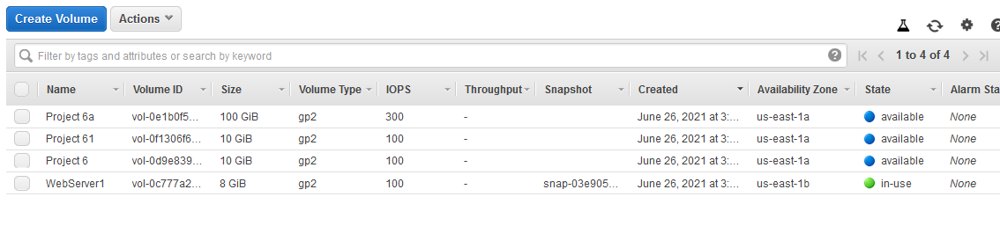
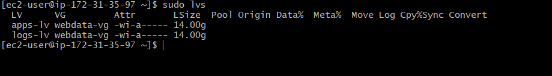
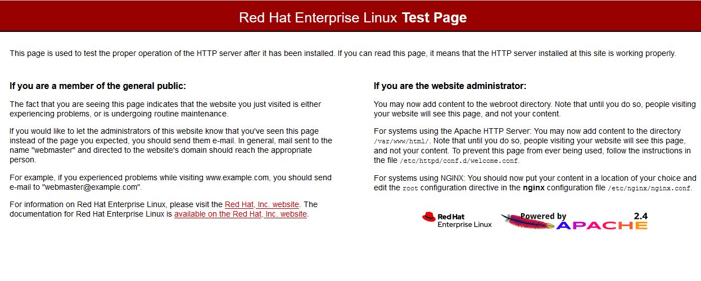
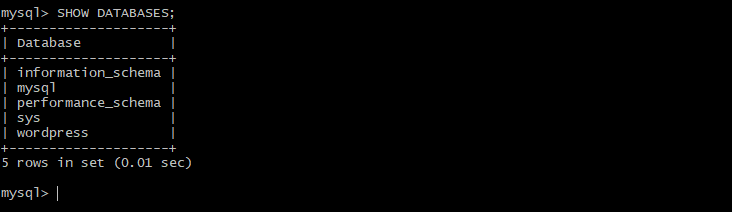
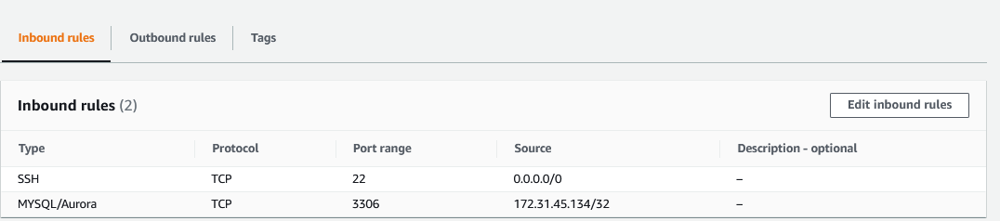
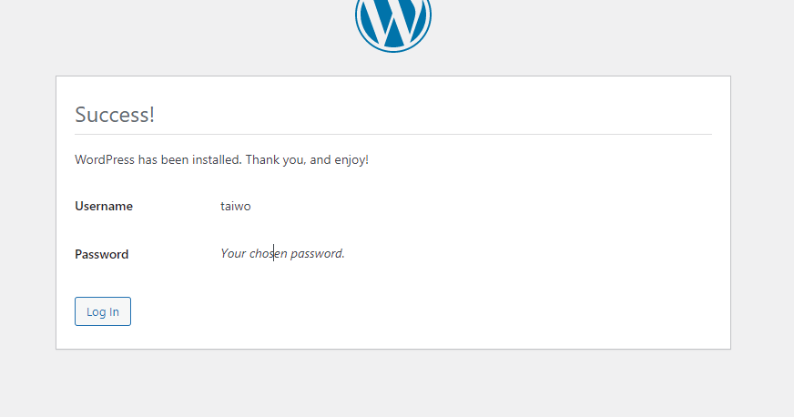
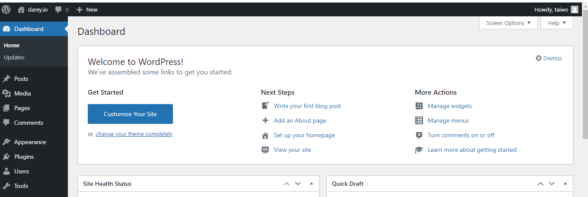
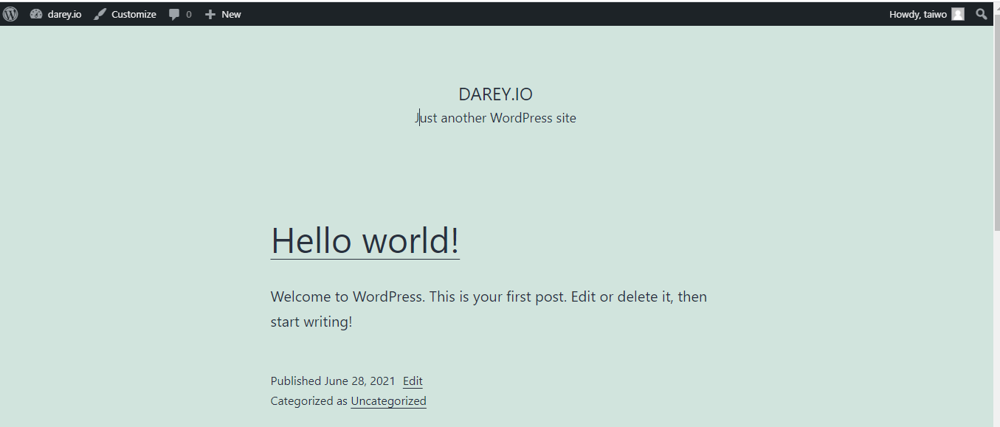

# WEB SOLUTION WITH WORDPRESS

Obective is to prepare to storage infrasctrure on two linux servers and implement a basic web solution using Wordpress.
NOTE: **Wordpress** is written in PHP and paired with **MariaDB** or **MySQL** as its RDBMS.
Firstly, we will configure storage subsystem for **Web and Database Servers** on Linux OS.
Secondly, we will install **Wordpress** and connect it to a remote MySQL database server.

## Prepare a Web Server and Database Server
* Spin up two EC2 instances. One will server as a "Web Server" and the other "Database Server"
* Create 3 volumes in each of the servers in the same AZ each of 10GB.

* Attach the 3 volumes on each server.
* Partition the disks and create a **physical volume**.
* Create a volume group and **logical volume managment** LVM.

* Use **ext4** filesystem to format the Logical Volume (LV).
* Create **/var/www/html** directory to store website files and mount it on LV.
* Update **/etc/fstab** file so that mount configuration will persist after restart of the server.

## Install Wordpress on your Web Server EC2
* Update the repository 
* Install Apache and its dependencies.
* Start Apache

* Install PHP and its dependencies.
* Restart Apache
* Download Wordpress and copy wordpress to **var/www/html**

## Install MySQL on Database Server and Web Server
* Install MySQL-server on DB server
* Install MySQL-client on Web Server.

## Configure  Database to work with Wordpress
* Log in to DB
* Create DB
* Grant all privileges to DB user and exit

## Configure Wordpress to connect to remote Database
* Open MySQL port 3306 on DB server 

## Change permissions and configuration so Apache could use WordPress.
* On DB server, edit /etc/my.cnf file to bind mysql
* On Web server, edit wp-config.php file and give permissions to connect to DB
* Restart Httpd 
* Enable TCP port 80 in Inbound rules on Web Server from everywhere 0.0.0.0/0
* Configure SELinux policies i.e change owner of **/var/www/html** file to Apache
* Access your browser using <web-server public IP address>/wordpress.

